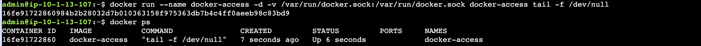
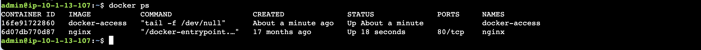

# SadServers "Quito": Control One Container from Another

## Video tutorial

Watch the complete solution walkthrough before following the written steps:

[Download or watch the Quito video tutorial](./Quito_Control_One_Container_From_Another_Tutorial.mov)

## Objective

Allow one Docker container to control another container from inside the
container. In this scenario, the `docker-access` container must be able to
start the existing `nginx` container.

## Important concept

The Docker CLI does not start containers by itself. It sends requests to the
Docker daemon through the Unix socket at `/var/run/docker.sock`.

Mounting the host's Docker socket into another container gives processes in
that container access to the host Docker daemon:

```text
host:      /var/run/docker.sock
               |
               +-- mounted as /var/run/docker.sock
                   inside docker-access
```

This is equivalent to giving the container control over the Docker host. Only
use this pattern for trusted containers, and avoid mounting the socket into
untrusted workloads.

## Solution

Run the commands below from the SadServers host as `admin`.

### 1. Confirm that the Docker socket exists

Inspect `/var/run` and look for `docker.sock`:

```console
$ ls -al /var/run/
```

The important entry looks similar to this:

```text
srw-rw---- 1 root docker 0 ... docker.sock
```

The `s` at the beginning identifies a Unix socket. The socket is owned by
`root:docker` and is the endpoint used by Docker clients.


### 2. Remove the stale access container

List all containers, including stopped containers:

```console
$ docker ps -a
```

If an old `docker-access` container is present, remove it:

```console
$ docker rm -f docker-access
```

The `-f` option removes the container even if it is still running. If the
container does not exist, Docker reports an error; in that case, continue with
the next step.


### 3. Start a container with access to the Docker socket

Create a new background container and bind-mount the socket:

```console
$ docker run --name docker-access -d \
    -v /var/run/docker.sock:/var/run/docker.sock \
    docker-access \
    tail -f /dev/null
```

The options have these roles:

| Option | Purpose |
| --- | --- |
| `--name docker-access` | Gives the helper container a predictable name |
| `-d` | Runs the container in the background |
| `-v /var/run/docker.sock:/var/run/docker.sock` | Exposes the host Docker socket at the same path inside the container |
| `docker-access` | Image used for the helper container |
| `tail -f /dev/null` | Keeps the helper container running |

Verify that the helper container is running:

```console
$ docker ps
```



### 4. Use Docker from inside `docker-access`

Open a shell in the helper container:

```console
$ docker exec -it docker-access sh
```

Confirm that the socket is available inside the container:

```console
/usr/src/app # ls /var/run/
```

The output should include `docker.sock`. The Docker CLI in this container can
now communicate with the host daemon, so start the target container:

```console
/usr/src/app # docker start nginx
nginx
/usr/src/app # exit
```


### 5. Verify the result from the host

Back on the host, list running containers:

```console
$ docker ps
```

Both `docker-access` and `nginx` should now be running:

```text
CONTAINER ID   IMAGE          COMMAND               STATUS          PORTS    NAMES
...            docker-access  "tail -f /dev/null"   Up ...                    docker-access
...            nginx          "/docker-entrypoint..." Up ...          80/tcp   nginx
```



## Troubleshooting

- **`Cannot connect to the Docker daemon`**: Check that
  `/var/run/docker.sock` was mounted into `docker-access` and that the
  container has a Docker CLI.
- **`No such container: docker-access`**: There is no stale helper container to
  remove. Run the `docker run` command directly.
- **`nginx` does not start**: Run `docker ps -a` from inside
  `docker-access` to inspect the target container's status and logs.
- **Permission denied on `docker.sock`**: Check the socket permissions and the
  user running the Docker CLI. The socket grants powerful host-level access,
  so do not solve this by exposing it to untrusted users or containers.

## Key takeaway

Mounting `/var/run/docker.sock` into a container lets its Docker client issue
commands to the host Docker daemon. This is why `docker-access` can start
`nginx` even though the command is executed from inside another container.
